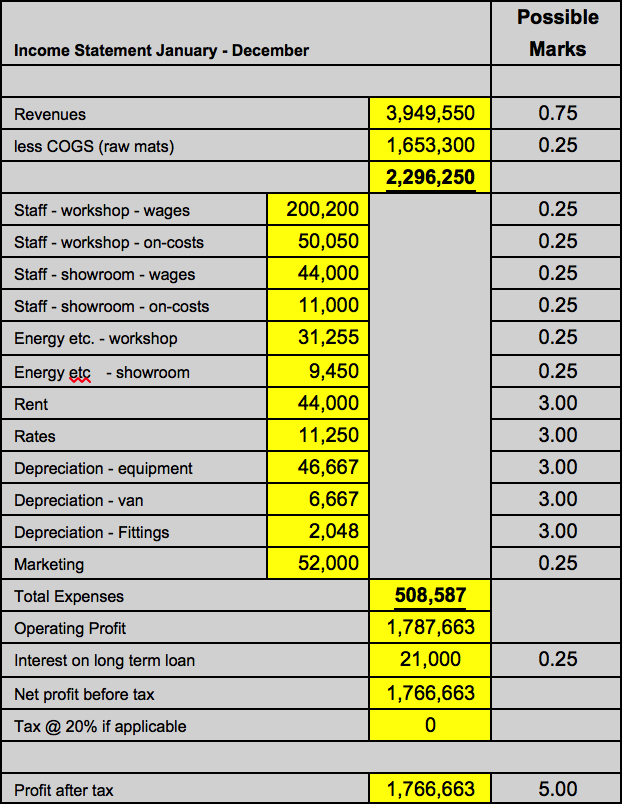

# Understanding Financial Statement

Wei, Zhe

###### © Creative Commons BY-NC-ND 4.0

## Question 1: The Accrual Basis of Accounting

The essential accounting principle applied to the preparation of the income statement is the accruals basis of accounting. The principle that all income and expenditure incurred in a period is recognized for that period is referred to as the accruals basis of accounting. It could be further explained as: 1) the timing of cash received and cash paid is irrelevant in the preparation of financial statements; 2) transactions are reflected in financial statements on the basis of when they took place not on when the cash was received or paid (Scott, 2012).

The principle will be illustrated by financial statements of ‘The Seabin Project’ from two aspects: cash received vs. income, cash paid vs. expense with a special form of expense – depreciation.

##### Cash received vs. income

Considering the cash received in the cash budget, as the local councils are offered 1 month’s credit and the construction companies offered 2 months’ credit, the annual total cash received from the three customers will be £3,072,770. The cash of December sales to local council will be received in January of next year and the cash of November and December sales to construction companies will be received in January and February of next year respectively. However, as the income statement follows the rule that transactions are reflected in financial statements on the basis of when they took place, the annual forecasted revenues will be £3,545,410, which is slightly greater than the cashed received.

##### Cash paid vs. expense

The same principle also applied to the expense. Let take the staff on-costs for example. The cash outflow of staff on-costs for workshop and showroom is generated from March and will be payable 1 month in arrears. Therefore, the annual cash flow for staff on-costs of workshop will be £47,775 and showroom be £10,725 in comparison to expense of £53,900 and £12,100 that are counted from the month occurred.

##### Depreciation

Depreciation is a special form of expense. It can be observed from the cash budget that capital of non-current asset, such as equipment and vans, is recognized as a cash outflow of £350,000 and £60,000 respectively on April. As the cost of non-current assets is allocated to the income statement each year, the equipment will be depreciated at a cost of £5,833.33 and the vans will be depreciated at a cost of £833.33 each month. As a result, the annual depreciation of equipment and vans in income statement will be recognized as £46,667 and £6,667.

## Question 2: Budgeted Financial Statements

To realize the expectation of 1) generating at least an operating profit margin of 45%, and 2) ensuring a maximum cash deficit of no more than £50,000 in each of the trading month, current performance has to be identified in the first place: the operating profit margin is about 35.73% and the maximum cash deficit of the trading month occurs in April as -£417,700 with cash deficit exceeding £50,000 in May as well.

1. ##### Profit Margin

Generally speaking, the profit margin can be increased by either increase the revenue or reduce the expense.

* To raise the revenue

Since the business premises show that a majority of products will be targeted to local councils with a relatively lower selling price, it is proposed to change the selling strategy, the quotation to local councils can be reduced in order to increase the other two of higher selling price.

* To reduce the expense

Two alternatives are suggested: 1) to renegotiate with the supplier on the cost of raw materials. Either lower price can be bargained or overall lower price based on a tiered tariff from supplier could be discussed. Another suggestion is that as the current manufacture is on a just-in-time monthly basis could also be improved to a just-in-time on weekly basis. 2) to focus on the wage, it is suggested to have a slightly decreased pay per hour with offering future options for employees.

2. ##### Cash Deficit

Regarding the issue of cash deficit, the outstanding deficits can be observed from the cash budget table in April and May. It is mainly because of the outflow non-current asset purchase in April on one side and possible the shortage of inflow from product sales on the other side. it is suggested to have either payment by installment or deferred payment, or some other mode such as financial leasing to mitigate this effect. Other proposals can also be identified, such as making wage payment 1 month in arrears or reducing customers’ credit.

##### Conclusion

The following 5 concrete recommendations are specified and applied to the financial statements:

1. Adjust sales proportion to marinas and ports to 50%, local councils to 20% and construction companies to 30%.
2. Negotiate the averaged cost to £900 per product.
3. Trade current staff pay for future options: £13 per hour for workshop and £10 per hour for showroom.
4. Make payment by installment for non-current asset. E.g. a two years’ simple interest of 20% for equipment plus one year’s simple interest of 10% for vans.
5. Shift wage payment 1 month 1 arrears.

The result will be provided in appendix.

###### Reference

>Scott, P., (2012) Accounting for Business: An Integrated Print and Online Solution: OUP Oxford.

###### Appendix

* Budgeted Income Statement

* Cash Budget

